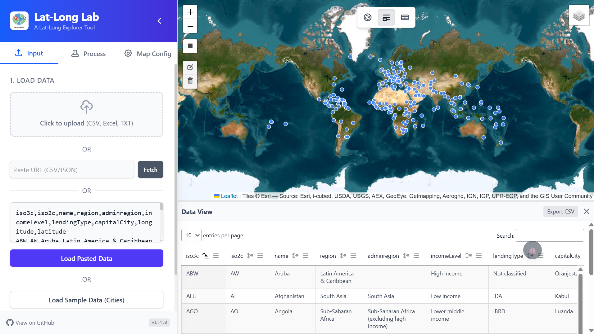

# Lat-Long Lab


**A super light, privacy focused web app for a quick latitude-longitude visualization and data filtering.**

https://shringi.github.io/Lat-Long-Lab/

Current Version: 1.4.1

Last Updated on: 2025-Dec-09

## Motivation

We often encounter datasets containing latitude and longitude points along with various associated columns. The need to quickly visualize and locate these points is common. Frequently, the goal is to filter this data for a specific country, a selected area, or by a specific property.

Researchers and analysts often deal with supplementary materials from publications and need to filter data for particular regions. While tools like R, Python, or QGIS are powerful, they can be overkill for quick visualization and filtering tasks, often requiring code execution or heavy software loading.

**Lat-Long Lab** was created to bridge this gap. It is a tool that:
- **Does not depend on any server or API calls.**
- **Fast and Responsive** (performance depends only on your browser).
- **Runs entirely on the client-side**, ensuring data privacy and ease of use.

## Features

- **Versatile Data Loading**:
    - Upload **CSV, Excel (.xlsx, .xls), or TXT** files.
    - **Paste** data directly from your clipboard.
    - **Fetch** data from a URL (CSV/JSON).
- **Interactive Mapping**:
    - Visualize thousands of points instantly on a Leaflet map.
    - Switch between different basemaps (OpenStreetMap, Satellite, etc.).
- **Geographic Filtering**:
    - Draw a **rectangular area** on the map to select specific points.
    - Filter your dataset to include only points within the selected region.
- **Data Enrichment**:
    - **Country Tagging**: Automatically tag points with their country name using offline spatial join.
    - **UTM Conversion**: Convert Lat/Long coordinates to UTM Zone/Easting/Northing.
- **Data Inspection**:
    - View your data in a powerful, sortable, and searchable table (powered by DataTables).
    - Toggle between **Full Map**, **Split View**, and **Full Table** using the top-center controls.
- **Export**:
    - Download your filtered or enriched dataset as a CSV file.
- **Privacy-First**:
    - 100% Client-side processing. Your data never leaves your browser.
- **Modern UI**:
    - **Collapsible Sidebar**: Maximize screen real estate with the new Rail Mode.
    - **Unified View Control**: Seamlessly switch between Full Map, Split View, and Full Table layouts.

## Usage Instructions

### 1. Getting Started
You can test the application immediately without providing external files:
- **Sample Data:** Click **"Load Sample Data (Cities)"** to load a representative dataset found in `js/modules/data.js`.
- **File Upload:** Upload **CSV, Excel (.xlsx), or TXT** files via the file input interface.
- **Direct Input:** Paste raw CSV data directly into the provided text area.
- **Fetch from URL**: Enter a direct link to a CSV or JSON file and click "Fetch". 
  - For example use the following url to import worldbank data. 
  ```text
  https://raw.githubusercontent.com/prasertcbs/basic-dataset/refs/heads/master/worldbank_countries.csv
  ```

*Note: The application automatically detects "Latitude" and "Longitude" columns. Manual overriding is available if detection fails.*

### 2. Exploration & Filtering
- **Visualization:** Points are rendered as clustered markers on the map. Zooming in reveals individual data points.
- **Spatial Filtering:** Activate the **Rectangle Tool** from the map toolbar to define a region of interest. Toggle **"Filter by Map Selection"** to restrict the dataset to points within the bounded area.

### 3. Data Enrichment
This feature allows for local spatial joins:
1.  Filter your data to a specific region (optional).
2.  Navigate to the **"Process"** tab.
3.  Select **"Add Country Column"**.
4.  The application performs a point-in-polygon operation against an onboard GeoJSON dataset to append a `country` attribute to each record.


### 4. Data Export
- Navigate to the **"Export"** tab or the Data Table view.
- Select **"Download CSV"** to export the processed dataset, including any applied filters and enriched attributes.

### 5. Debug Console
For advanced troubleshooting and development:
- **Open:** Click the floating  🐞 icon in the bottom-right corner.
- **Functionality:** View real-time logs, errors, and system status.
- **Controls:**
    - **Minimize:** Hides the console tray.
    - **Clear:** Removes all current logs.
    - **Copy:** Copies all logs to clipboard for sharing.
- **Draggable:** You can drag the debug icon anywhere on the screen to view content behind it.

## Troubleshooting & Debugging

If you encounter unexpected behavior, a **Debug Console** is available:
1.  Click the **Debug Icon (🐞)** located in the bottom-right corner of the screen.
2.  This console displays real-time execution logs and error messages.
3.  When reporting issues on GitHub, please look for "Error" messages in this console and include them in your report.

## Reporting Bugs & Feature Requests

We welcome feedback! If you encounter any issues or have ideas for new features:

1.  Navigate to the **[Issues](https://github.com/shringi/Lat-Long-Lab/issues)** tab.
2.  Click **"New Issue"**.
3.  Choose **"Bug Report"** or **"Feature Request"**.
4.  Provide detailed steps to reproduce the issue and any relevant logs from the Debug Console.

## Credits
Built with open-source power:
- [Leaflet](https://leafletjs.com/)
- [DataTables](https://datatables.net/)
- [Tailwind CSS](https://tailwindcss.com/)
- [PapaParse](https://www.papaparse.com/)
- [SheetJS](https://sheetjs.com/)
- [Turf.js](https://turfjs.org/)
