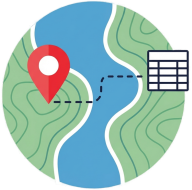
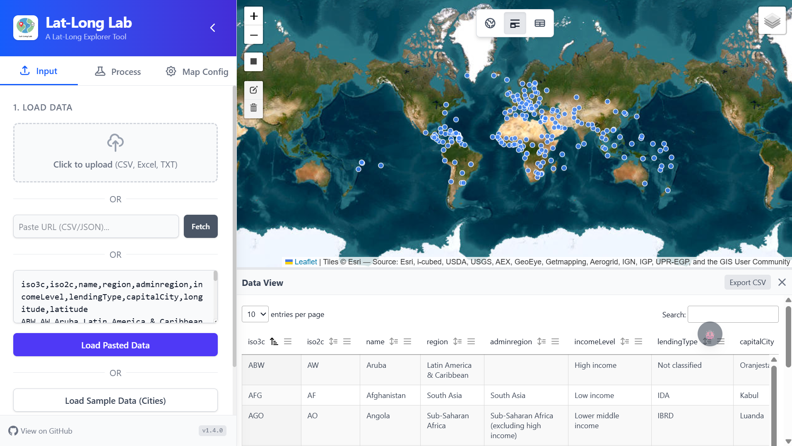

# Lat-Long Lab



**A super light, privacy focused web app for a quick latitude-longitude visualization and data filtering.**

https://shringi.github.io/Lat-Long-Lab/

Current Version: 1.5.1

Last Updated on: 2026-Mar-19

## Motivation

We often encounter datasets containing latitude and longitude points along with various associated columns. The need to quickly visualize and locate these points is common. Frequently, the goal is to filter this data for a specific country, a selected area, or by a specific property. While tools like R, Python, or QGIS are powerful, they can be overkill for quick visualization and filtering tasks, often requiring code execution or heavy software loading.

**Lat-Long Lab** was created to bridge this gap. It is a tool that:
- **Fast and Responsive** (performance depends only on your browser).
- **Runs entirely on the client-side**, ensuring data privacy and ease of use.
- **Installable** (as a PWA).
- **Does not depend on any server or API calls.**

## Features



- **Versatile Data Loading**:
    - Upload **CSV, Excel (.xlsx, .xls), TXT, KML, KMZ, GeoJSON** files.
    - **Import Wizard**: Intelligent, automatic detection of Latitude/Longitude or UTM coordinates (Zone/Easting/Northing). Features robust delimiter support including Comma, Semicolon, Space, Tab, and Custom delimiters, with an option to merge consecutive whitespaces for fixed-width data.
    - **Paste** data directly from your clipboard.
    - **Fetch** data from a URL (CSV/JSON).
- **Interactive Mapping**:
    - Visualize thousands of points instantly on a Leaflet map.
    - Switch between different basemaps (OpenStreetMap, Satellite, etc.).
- **Geographic Filtering**:
    - Draw a **rectangular area** on the map to select specific points.
    - Filter your dataset to include only points within the selected region.
- **Data Enrichment**:
    - **Country Tagging**: Automatically tag points with their country name using offline spatial join.
    - **UTM Conversion**: Calculate and append UTM Zone, Easting, and Northing columns to your Lat/Long data.
- **Data Inspection**:
    - View your data in a powerful, sortable, and searchable table (powered by [DataTables](https://datatables.net/)).
    - Toggle between **Full Map**, **Split View**, and **Full Table** using the top-center controls.
- **Export**:
    - Download your filtered or enriched dataset as:
        - **CSV** (Spreadsheet)
        - **GeoJSON** (Web GIS)
        - **KML / KMZ** (Google Earth)
        - **Shapefile** (ESRI/QGIS)
- **Privacy-First**:
    - 100% Client-side processing. Your data doesn't leave your browser.
- **Modern UI & PWA**:
    - **Progressive Web App**: Install as a native app on Chrome/Edge and works offline. Click the install button appearing in the address bar.
    - **Collapsible Sidebar**: Maximize screen real estate with the new Rail Mode.
    - **Unified View Control**: Seamlessly switch between layout modes.

## Usage Instructions

### 1. Getting Started
You can test the application immediately without providing external files:
- **Sample Data:** Click **"Load Sample Data (Cities)"** to load a representative dataset.
- **File Upload:** Upload supported files (`.csv`, `.xlsx`, `.kml`, `.geojson` etc.) via the file input.
- **Import Wizard:** If your data describes locations using UTM coordinates, check the "My data has UTM coordinates" box in the wizard to map Easting and Northing columns.
- **Direct Input:** Paste raw CSV data directly into the provided text area.
- **Fetch from URL:** Enter a direct link to a CSV or JSON file and click "Fetch".

### 2. Exploration & Filtering
- **Visualization:** Points are rendered as clustered markers on the map. Zooming in reveals individual data points.
- **Spatial Filtering:** Activate the **Rectangle Tool** from the map toolbar to define a region of interest. Toggle **"Filter by Map Selection"** to restrict the dataset to points within the bounded area.

### 3. Data Enrichment
This feature allows for local spatial joins and coordinate conversions:
1.  Filter your data to a specific region (optional).
2.  Navigate to the **"Process"** tab.
3.  Select **"Add Country Column"** to tag points with countries.
4.  Select **"Add UTM Columns"** to generate metric coordinates.

### 4. Data Export
- Navigate to the **"Export"** tab or the Data Table view.
- Select your desired format (**CSV, Shapefile, KML, GeoJSON**).
- Click **Download** to export the processed dataset, including any applied filters and enriched attributes.

### 5. Debug Console
For advanced troubleshooting and development:
- **Open:** Click the floating  🐞 icon in the bottom-right corner.
- **Functionality:** View real-time logs, errors, and system status.
- **Controls:** Minimize, Clear, Copy. (Draggable).

## Troubleshooting & Debugging

If you encounter unexpected behavior, a **Debug Console** is available:
1.  Click the **Debug Icon (🐞)** located in the bottom-right corner of the screen.
2.  This console displays real-time execution logs and error messages.
3.  When reporting issues on GitHub, please look for "Error" messages in this console and include them in your report.

## Reporting Bugs & Feature Requests

We welcome feedback! If you encounter any issues or have ideas for new features:

1.  Navigate to the **[Issues](https://github.com/shringi/Lat-Long-Lab/issues)** tab.
2.  Click **"New Issue"**.
3.  Choose **"Bug Report"** or **"Feature Request"**.
4.  Provide detailed steps to reproduce the issue and any relevant logs from the Debug Console.

## Credits

Built with open-source power:
- [Leaflet](https://leafletjs.com/)
- [DataTables](https://datatables.net/)
- [Tailwind CSS](https://tailwindcss.com/)
- [PapaParse](https://www.papaparse.com/)
- [SheetJS](https://sheetjs.com/)
- [Turf.js](https://turfjs.org/)
- [shp-write](https://github.com/mapbox/shp-write)
- [tokml](https://github.com/mapbox/tokml)
- [JSZip](https://stuk.github.io/jszip/)

## Development

This repository is structured as a Monorepo.

### Project Structure
- `apps/web`: The core web application code.
- `package.json`: Root configuration managing workspaces.

### Setup
```bash
git clone https://github.com/shringi/Lat-Long-Lab.git
cd Lat-Long-Lab
pnpm install
pnpm dev:web
```
